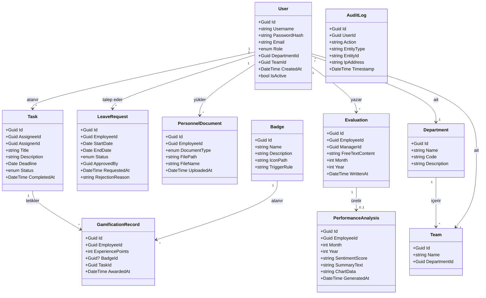

# Veri Gereksinimleri — İnsan Kaynakları Otomasyonu

*Bu doküman, İk_Gereksinim_Raporu.docx içindeki 3. bölüm Veri Gereksinimleri için doldurulmuş içerikleri içerir.*

---

## 3 Veri Gereksinimleri

### İçerik

Bu projede, İnsan Kaynakları Otomasyonu sisteminin ürünle ilgili temel konusu, iş nesneleri, varlıklar ve sınıflar belirtilmelidir. Kimlik doğrulama, özlük yönetimi, izin süreçleri, görev-Kanban yönetimi, oyunlaştırma motoru (XP, rozet) ve yapay zekâ destekli değerlendirme analizi modüllerinin veri yapıları, Birleşik Modelleme Dili (UML) sınıf modeli gösterimi veya etki alanı modeli şeklinde tanımlanacaktır. Her varlık için öznitelikler, ilişkiler ve veri sözlüğü (7c bölümü) ile tutarlı olacaktır.

### Motivasyon

Sistemin konusunu açıklığa kavuşturmak, böylece henüz dikkate alınmamış gereksinimlerin tanınmasını tetiklemek. Oyunlaştırma puanları, yapay zekâ analiz sonuçları ve özlük verileri gibi hassas bilgilerin nasıl saklanacağı, hangi varlıklar arasında ilişki kurulacağı ve veritabanı tutarlılığının nasıl sağlanacağı, veri modeli netleşmeden belirlenemez. Ayrıca, geliştirme ekibinin ortak bir veri diline sahip olması, API tasarımı ve test senaryoları için temel oluşturur.

---

## Örnek — Etki Alanı Modeli / Sınıf Diyagramı

Bu, Birleşik Modelleme Dili (UML) sınıf modeli gösterimini kullanan sistemin iş tanımlarının bir modelidir.

### Şekil 6 — İnsan Kaynakları Otomasyonu Sınıf Diyagramı (Özet)

---

## Tablo 12 — Varlık ve Sınıf Özet Tablosu

| Varlık / Sınıf Adı | Açıklama | İlgili Modül |
|--------------------|----------|--------------|
| **User** | Sisteme giriş yapan kullanıcı (Çalışan, Yönetici, İK). Rol, departman ve takım bilgisi taşır. | Kimlik Doğrulama, RBAC |
| **Department** | Şirket içi organizasyonel birim. | UC-03 |
| **Team** | Departmana bağlı takım. | UC-03 |
| **LeaveRequest** | Çalışanın talep ettiği izin (başlangıç/bitiş tarihi, onay durumu). | UC-05, UC-06, UC-07 |
| **PersonnelDocument** | Özlük belgesi (CV, diploma vb.) dosya referansı. | UC-04 |
| **Task** | Yönetici tarafından atanan görev (başlık, teslim tarihi, Kanban durumu). | UC-08, UC-09 |
| **GamificationRecord** | Görev tamamlandığında otomatik atanan XP ve rozet kaydı. | UC-10 |
| **Badge** | Rozet tanımı (ad, tetikleyici kural, ikon). | UC-10, UC-13 |
| **Evaluation** | Yöneticinin serbest metin formatında yazdığı aylık değerlendirme. | UC-14 |
| **PerformanceAnalysis** | NLP/LLM ile üretilen duygu skoru, özet metin ve grafik verisi. | UC-15, UC-16, UC-17 |
| **AuditLog** | Kritik işlemlerin denetim kaydı (kim, ne zaman, hangi IP). | FR020, Denetim |

---

## Veri Sözlüğü (Öznitelik Tanımları)

Aşağıda, etki alanı modelinde kullanılan temel veri akışları ve depoların sözlük tanımları yer almaktadır.

| Öznitelik / Alan | Varlık | Tanım |
|------------------|--------|------|
| **Username** | User | Sistemde tekil olan kullanıcı giriş adı. |
| **PasswordHash** | User | Şifrenin güvenli hash değeri (BCrypt vb.). |
| **Role** | User | Çalışan, Yönetici veya İK. RBAC için kullanılır. |
| **StartDate, EndDate** | LeaveRequest | İzin aralığı. Hafta sonu kısıtlamaları hesaplamada düşülür. |
| **Status** | LeaveRequest, Task | İzin: Beklemede/Onaylandı/Reddedildi. Görev: Yapılacak/Devam Ediyor/Bitti. |
| **ExperiencePoints** | GamificationRecord | Tamamlanan göreve göre otomatik hesaplanan puan. |
| **FreeTextContent** | Evaluation | Yöneticinin NLP'ye gönderilen ham değerlendirme metni. |
| **SentimentScore** | PerformanceAnalysis | NLP çıktısı; pozitif/nötr/negatif veya sayısal skor. |
| **SummaryText** | PerformanceAnalysis | LLM tarafından üretilen aylık performans özeti. |

---

## Hususlar

- Bu sistem tarafından ele alınan konu için yukarıdaki etki alanı modeli, fonksiyonel gereksinimler (FR001–FR020) ve Ürün Kullanım Durum Listesi (UC-01–UC-17) ile uyumlu olacak şekilde türetilmiştir.
- Benzer veya örtüşen İK yazılımları (örn. SAP SuccessFactors, Workday) için mevcut modeller referans alınabilir; ancak bu proje kapsamında oyunlaştırma motoru ve yapay zekâ entegrasyonu özgün veri yapıları gerektirmektedir.
- Veritabanı seviyesinde **Transaction** kullanımı (özellikle görev tamamlama + XP ataması), veri bütünlüğü gereksinimleri (FR019) ile uyumlu olarak tasarlanacaktır.
- Kişisel veriler (CV, değerlendirme metni vb.) KVKK kapsamında şifreli depolanacak; veri sözlüğü bu kısıtlamalarla tutarlı tutulacaktır.
